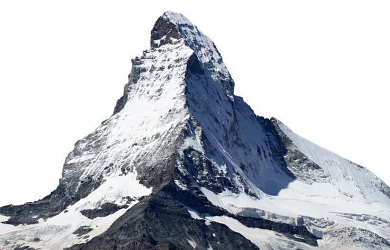
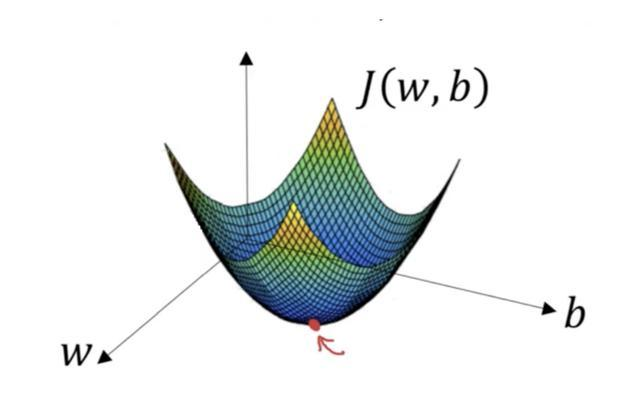
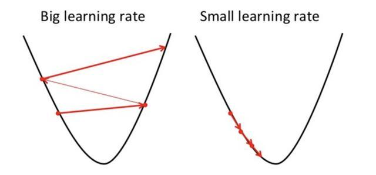
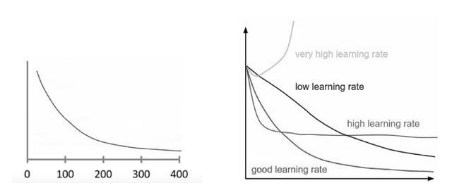

# 梯度下降法

## 梯度下降法 

适用：**训练模型**时，可以和**每种**算法结合使用

目标：**求最小值**

概括：基于凸函数的**优化算法**，迭代地调整参数以使给定函数最小化

应用：**机器学习和深度学习**

### 工作原理

首先定义初始参数值，然后在渐变下降中使用微积分迭代调整值，以使它们最小化给定的[成本函数](https://baike.baidu.com/item/%E6%88%90%E6%9C%AC%E5%87%BD%E6%95%B0/2685562?fr=aladdin)。

> ***什么是梯度？***
>
> 它简单的衡量了所有权重的变化，并考虑到误差的变化。你也可以将梯度看作函数的斜率，坡度越高，坡度越陡，模型可以学习得越快。但如果斜率为零，模型就停止学习了。更精确地说，梯度是关于其输入的偏导数。

#### 详细介绍：

首先想象一个登山者爬山，他想要用最短的距离到达山顶。

那么，他就需要不断的寻找当前位置最陡峭的方向，然后做出调整，最后他能够从自己的起点到达山顶，用了最短的距离。其次，我们再想象一群人爬山，都想用最短的距离到达山顶，很幸运，最终每个人的目标都达到了，那么这一群人中走的路程最短的人就是**全局最优解**，这一群人中的某个人用的最短距离就是**局部最优解**。

在爬山的过程中，我们把登山者前进的 *方向和步长* 用一个向量表示，这个向量的长度(**步长**)**就是学习率**。(学习率将在下面介绍)

上面的等式描述了梯度下降的作用：“b”描述了我们登山者的下一个位置，而“a”代表了他的当前位置。减号表示梯度下降的最小化部分。中间的“gamma”是一个等待因素，梯度项 Δf(a) 仅仅是最陡下降的方向。

所以这个公式基本上告诉你下一个你需要去的位置，这是最陡下降的方向。

**但要确保你完全理解这个概念，需要通过另一个例子**

> 想象一下，你正在处理机器学习问题，并希望通过梯度下降训练你的算法，以最小化成本函数 **J(w,b)**，并通过调整其参数（w和b）来达到其局部最小值。
>
> 让我们来看看下面的图片，这是梯度下降的例证。水平轴表示参数（**w** 和 **b**），成本函数 **J(w,b)** 表示在垂直轴上。你也可以在图像中看到渐变下降是一个凸函数。
>
> 
>
> 就像你已经知道的那样，我们想要查找与成本函数的最小值相对应的 **W** 和 **B** 的值（用红色箭头标记）。首先找到正确的值，我们用一些随机数初始化 **W** 和 **B** 值，然后梯度下降从那一点开始（在我们的插图的顶部附近）。然后以最陡的下行方向（例如从图的顶部到底部）一步接一步，直到它达到成本函数尽可能小的点。

**学习率的重要性**

> 梯度下降到占据局部最小值的方向有多大，取决于所谓的学习率。它决定了我们如何快速或慢速朝着最优权重。
>
> 为了使梯度下降达到当地最低限度，我们必须将学习率设置为适当的值，该值既不低也不太高。
>
> 这是因为如果步骤太大，它可能不会达到局部最小值，因为它只是在梯度下降的凸函数之间来回跳动，就像你可以在下面的图像左侧看到的那样。如果你将学习速率设置为非常小的值，渐变下降最终将达到局部最小值，但它可能会花费太多时间，就像你可以在图像的右侧看到的那样。
>
> 
>
> 这就是为什么学习率不应该太高也不能太低。你可以通过在图表上绘制学习率来检查你的学习速度是否正常，我们将在下面部分讨论。

**如何确保它正常工作**

> 确保梯度下降正常运行的一种好方法是将梯度下降运行时的成本函数绘制成图。**x** 轴上的迭代次数和 **y** 轴上的成本函数值使你可以在每次迭代梯度下降后查看成本函数的值。这可以让你轻松找出适合的学习率。而你只需尝试不同的值并将它们一起绘制。
>
> 你可以在左侧看到这样的情节，右侧的图像显示了好的和不好的学习率之间的差异：
>
> 
>
> 如果梯度下降是正常工作，则每次迭代后成本函数应该降低。
>
> 当梯度下降不再降低成本函数并且保持或多或少处于同一水平时，我们说它已经**收敛**。请注意，梯度下降需要收敛的迭代次数有时会有很大差异。它可能需要50次迭代，6万次甚至300万次。因此，迭代次数很难预先估计。
>
> 另外还有一些算法可以自动告诉你，如果梯度下降已经收敛，但你需要事先定义一个 **阀值** (临界值) 的收敛，这也很难估计。这就是为什么这些简单的情节是首选的 **收敛性测试** 。
>
> 通过绘图监视渐变下降的另一个优点是，你可以很容易地发现它是否无法正常工作，例如，如果成本函数正在增加。大多数情况下，使用渐变下降的成本函数越来越多，原因是学习速度过高。
>
> 如果你在情节中看到你的学习曲线正在上升和下降，而没有真正达到低点，你也应该尝试降低学习速度。顺便说一下，当你在一个给定的问题上开始使用梯度下降法时，只需简单地尝试0.001,0.003,0.01,0.03,0.1,0.3,1等等，看看它的学习速度哪一个表现最好。

**梯度下降的类型**

> 外面有三种流行的梯度下降类型，主要是它们使用的数据量不同，我们一一浏览它们。
>
> *批次梯度下降*
>
> 批次梯度下降也称为香草梯度下降，计算训练数据集内每个示例的误差，但只有在所有训练样例已经评估后，模型才会更新。整个过程就像一个循环，称为训练时代。
>
> 它的优点是它的计算效率高，它产生一个稳定的误差梯度和稳定的收敛。批梯度下降具有的缺点是，稳定的误差梯度有时可能导致收敛状态不是模型能达到的最佳状态。它还要求整个训练数据集存储在内存中并可供算法使用。
>
> *随机梯度下降*
>
> 相反，随机梯度下降（SGD）对于数据集内的每个训练样例都是这样。这意味着它会逐个更示例个训练示例的参数。这可能会使SGD比批量渐变下降更快，具体取决于问题。一个好处是频繁的更新使我们有一个相当详细的改进速度。
>
> 问题在于频繁更新的批处理梯度下降方法在计算上更加昂贵。这些更新的频率也会导致噪音梯度，这可能会导致错误率跳跃，而不是缓慢下降。
>
> *迷你批次梯度下降*
>
> 小批量梯度下降法是一种先进的方法，因为它是SGD和批次梯度下降概念的组合。它只是将训练数据集分成小批量，并为这些批次中的每个批次执行更新。因此它可以在随机梯度下降的稳健性和批梯度下降的效率之间建立平衡。
>
> 常见的小批量大小范围在50到256之间，但是对于任何其他机器学习技术而言，没有明确的规则，因为它们可以针对不同的应用而变化。请注意，它是在训练神经网络时的go-to算法，它是深度学习中**最常见**的梯度下降类型。

## 总结

在这篇文章中，你学到了很多关于梯度下降的知识。你现在知道它的基本术语，并且了解该算法如何在幕后工作。此外，你了解了为什么学习率是最重要的超参数，以及如何检查算法是否能够使你正确训练你的模型。

最后，你了解了三种最常见的梯度下降类型及其优缺点。这些知识使你能够正确地训练模型。

本文参考：[深度解读流行梯度下降优化算法](https://baijiahao.baidu.com/s?id=1594440348949339504&wfr=spider&for=pc)