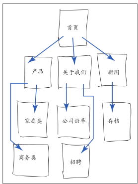
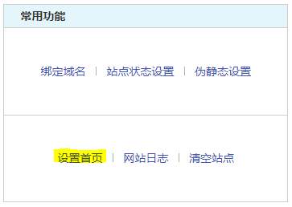
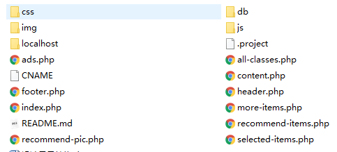

## 网页的构造块

### 基本的HTML页面

- 以 `<!DOCTPYE html>`开始

- `<html lang="en">`指定网页语言
- `<meta charset="utf-8"/>`指定编码格式，或者定义标签，此处未给出
- `<body>`指定网页主体

### 标签：元素、属性、值及其它

#### 常用元素

| 元素    | 含义               |
| ------- | ------------------ |
| a       | 链接               |
| article | 定义一段独立的内容 |
| em      | 强调               |
| h1      | 一级标题           |
| img     | 图像               |
| p       | 段落               |

- 属性和值：以 a 标签为例

  `<a href="#" rel="external" title="learn more about Blue Flax">Blue Flax</a>`

  其他标签和属性值的说明可以参考[[link](http://www.w3school.com.cn/tags/index.asp)]

#### 父元素和子元素

```
<p>... continually <em>amazed</em> ...</p>
<p>... continually <em>amazed ...</p></em>
```

元素必须正确地嵌套。如果先开始 p ，再开始 em ，就必须先结束 em ，再结束 p

### 网页的文本内容

##### 输入特殊符号

-  &copy; `&copy;` 其他可见[[link](http://www.elizabethcastro.com/html/extras/entities.html)]

##### 字符编码匹配

- Unicode和UTF-8

### 链接、图像和其他非文本内容

- 链接：参考 a 标签[[link](http://www.w3school.com.cn/tags/tag_a.asp)]
- 图像：参考 img 标签[[link](http://www.w3school.com.cn/tags/tag_img.asp)]
- 其他：视频参考 video 标签[[link](http://www.w3school.com.cn/tags/tag_video.asp)]，音频参考 audio 标签[[link](http://www.w3school.com.cn/tags/tag_audio.asp)]

### 文件名和文件夹名

- 好的文件命名方式可以增强（SEO）

  > 全部采用小写字母，且用短横杠分割。例如：book-manger

- 扩展名采用 .html

### URL

在浏览器中输入`http://www.site.com/tofu/`后，服务器会寻找默认的首页。其效果等同于输入`http://www.site.com/tofu/index.html`。

在浏览器中输入`mailto:somename@somedomain.com`后，触发邮件服务，打开邮件客户端发送邮件。

在浏览器中输入`ftp://ftp.site.com/pub/proposal.pdf`后会开始文件传输，下载文件。

> 路径有两种写法：绝对路径和相对路径

### HTML：有含义的标记

其重要性

1. 提升可访问性和互操作性（内容对于借助辅助技术的残障访问者是可访问的，同时对于台式机、手机、平板电脑及其他设备上的浏览器都是可访问的）。
2.  提升搜索引擎优化（SEO）的效果。 
3. 使维护代码和添加样式变得容易。
4. （通常）使代码更少，页面加载更快

### 浏览器对网页的默认显示效果

#### 块级元素

大多数元素：h1、p、article

#### 行内元素

短语内容：em、a、small

## 处理网页文件

### 规划网站

画出网站结构草图，考虑它可能包含的内容，有助于创建决定它需要何种结构



### 创建新的网页

使用编辑器：Notepad++，Sublineme，PyCharm等。

### 保存网页

保存为 .html 格式，注意文件的编码需要对应，否则会出现乱码问题。

### 指定默认页面或主页

网站发布后，可以在服务器或者虚拟主机上修改主机默认页面。如图（不同的商家不一样



### 编辑网页

重新打开保存的网页再次进入进行修改。

### 组织文件

如图：



### 在浏览器中查看网页

- 浏览器可以解析 html 文件，如果文件是 html 格式，可以直接双击查看。

- 其他格式需要配置环境，然后通过服务器打开。

### 借鉴他人的灵感

> 查看源代码

## 基本HTML结构

### 开始编写网页

### 创建页面标题

### 创建分级标题

### 普通页面构成

### 创建页眉

### 标记导航

### 标记页面的主要区域

### 创建文章

### 定义区块

### 指定附注栏

### 创建页脚

### 创建通用容器

### 使用ARIA改善可访问性

### 为元素指定类别或ID名称

### 为元素添加title属性

### 添加注释

## 文本

### 添加段落

### 指定细则

### 标记重要和强调的文本

### 创建图

### 指明引用或参考

### 引述文本

### 指定时间

### 解释缩写词

### 定义术语

### 创建上标和下标

### 添加作者联系信息

### 标注编辑和不再准确的文本

### 标记代码

### 使用预格式化的文本

### 创建换行

### 创建span

### 其他元素

## 图像

### 关于Web图像

### 获取图像

### 选择图像编辑器

### 保存图像

### 在页面中插入图像

### 提供替代文本

### 指定图像尺寸

### 在浏览器中改变图像的尺寸

### 在图像编辑器中改变图像的尺寸

### 为网站添加图标

## 链接

### 创建指向另一个网页的链接

### 创建锚并链接到锚

### 创建其他类型的链接

## CSS构造块

### 构造样式规则

### 为样式规则添加注释

### 理解继承

### 层叠：当规则发生冲突时

### 属性的值

## 操作样式表

### 创建外部样式表

### 链接到外部样式表

### 创建嵌入式样式表

### 应用内联样式表

### 样式的层叠和顺序

### 使用与媒体相关的样式表

### 借鉴他人的灵感

## 定义选择器

### 构造选择器

### 按名称选择元素

### 按类或ID选择元素

### 按上下文选择元素

### 选择第一个或最后一个子元素

### 选择元素的第一个字母或者第一行

### 按状态选择链接元素

### 按属性选择元素

### 指定元素组

### 组合使用选择器

## 为文本添加样式

### 本章之前与本章之后

### 选择字体系列

### 指定替代字体

### 创建斜体

### 应用粗体格式

### 设置字体大小

### 设置行高

### 同时设置所有字体值

### 设置颜色

### 设置背景

### 控制间距

### 添加缩进

### 对齐文本

### 修改文本的大小写

### 使用小型大写字母

### 装饰文本

### 设置空白属性

## 用CSS进行布局

### 开始布局的注意事项

### 构建页面

### 在旧版浏览器中为HTML5元素添加样式

### 对默认样式进行重置或标准化

### 盒模型

### 控制元素的显示类型和可见性

### 设置元素的高度和宽度

### 在元素周围添加内边距

### 设置边框

### 设置元素周围的外边距

### 使用元素浮动

### 控制元素浮动的位置

### 对元素进行相对定位

### 对元素进行绝对定位

### 在栈中定位元素

### 处理溢出

### 垂直对齐元素

### 修改鼠标指针

## 构建响应式网站

### 响应式Web设计：概述

### 创建可伸缩图像

### 创建弹性布局网格

### 理解和实现媒体查询

### 组合使用

### 兼用旧版IE

## 使用Web字体

### 什么是Web字体

### 在哪里能找到Web字体

### 下载第一个Web字体

### 理解@font-face规则

### 使用Web字体设置文本样式

### 为Web字体应用斜体和粗体

### 使用Google Fonts的Web字体

## 使用CSS 3进行增强

### 浏览器兼容性、渐进增强和polyfill

### 理解厂商前缀

### 为元素创建圆角

### 为文本添加阴影

### 为其他元素添加阴影

### 应用多重背景

### 使用渐变背景

### 为元素设置不透明度

### 生成内容的效果

### 使用sprite拼合图像

## 列表

### 创建有序列表和无序列表

### 选择标记

### 使用定制的标记

### 选择列表的起始编号

### 控制标记的位置

### 同时设置所有的列表样式属性

### 设置嵌套列表样式

### 创建描述列表

## 表单

### HTML5对表单的改进

### 创建表单

### 处理表单

### 对表单元素进行组织

### 创建文本框

### 为表单组件添加说明标签

### 创建密码框

### 创建电子邮件框、搜索框、电话框和URL框

### 创建单选按钮

### 创建复选框

### 创建文本区域

### 创建选择框

### 让访问者上传文件

### 创建隐藏字段

### 创建提交按钮

### 禁用表单元素

### 根据状态为表单设置样式

## 视频、音频和其他多媒体

### 第三方插件和步入原生

### 视频文件格式

### 在网页中添加单个视频

### 为视频添加控件和自动播放

### 为视频指定循环播放和海报图像

### 阻止视频预加载

### 使用多种来源的视频和备用文本

### 提供可访问性

### 音频文件格式

### 在网页中添加带控件的单个音频文件

### 自动播放、循环和预加载音频

### 提供带备用内容的多个视频源

### 添加具有备用Flash的视频和音频

### 高级多媒体

### 更多资源

## 表格

### 结构化表格

### 让单元格跨越多列或多行

## 添加JavaScript

### 加载外部脚本

### 添加嵌入脚本

### JavaScript事件

## 测试和调试网页

### 验证代码

### 测试页面

### 尝试一些测试技巧

### 检查常见错误：一般问题

### 检查常见错误：HTML

### 检查常见错误：CSS

### 如果图像不显示

## 发布网站

### 获得域名

### 为网站寻找主机

### 将文件传送至服务器

## 附录A HTML参考

## 附录B CSS引用

