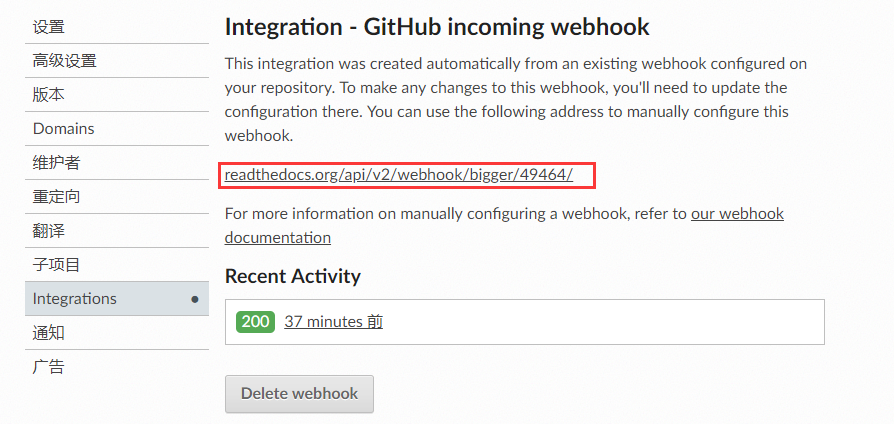
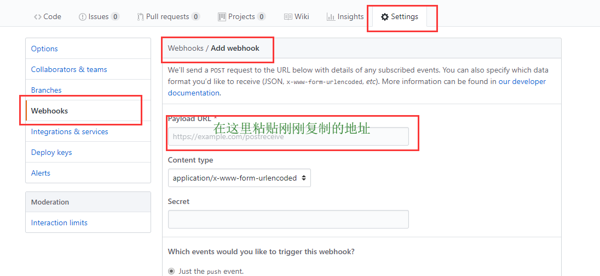

# Readthedocs + Github 搭建文档

## 环境配置Prepare

> 要求已经具备下列工具：
>
> - Python
> - pip
>
> 本教程是在Windows10上进行搭建的，Linux需要稍作修改

原文链接：[Getting Started](https://docs.readthedocs.io/en/latest/getting_started.html)

1. 安装Sphinx美化文章

```
$ pip install sphinx sphinx-autobuild
```

2. 在本地创建一个你要保存文档的文件夹，然后进入到该文件夹

```
$ cd /path/to/project
$ mkdir docs
$ cd docs
```

3. 使用sphinx-quickstart进行快速配置

```
$ sphinx-quickstart
```

4. 使用tree查看目录结构（该步骤可以跳过）
5. 修改 `index.rst` ，然后运行下面的命令进行预览

```
$ make html
```

6. 打开build文件夹下的html文件，即可预览。

## 支持Markdown格式

- 参考：[In Markdown](https://docs.readthedocs.io/en/latest/getting_started.html#in-markdown)

## 将本地修改提交到remote仓库

首先在根目录下（也就是和build，source等文件夹在同一级目录）建立一个`.gitignore`文件，其内容如下：

```
build/
.idea/
*.pyc
```

然后在本地建立一个仓库，并提交到远程，步骤如下：

- 第一步：本地建立git仓库

  ```
  cd到你的本地项目根目录下，执行git命令
  git init
  ```

- 第二步：将项目的所有文件添加到仓库中

  ```
  git add .
  如果想添加某个特定的文件，只需把.换成特定的文件名即可
  ```

- 第三步：将add的文件commit到仓库

  ```
  git commit -m "注释语句"
  ```

- 第四步：去github上创建Repository，点击下面的**New Organization**，拿到创建的仓库的https地址，不会创建可以参考[GitHub 实现多人协同提交代码并且权限分组管理](https://www.cnblogs.com/zhaoyanjun/p/5882784.html)

- 第五步：重点来了，将本地的仓库关联到github上

  ```
  git remote add origin github仓库地址
  ```

- 第六步：上传github之前，要先pull一下，执行如下命令：

  ```
  git pull origin master
  ```

  _错误提示 : fatal: refusing to merge unrelated histories_

  ```
  解决：在进行git pull 时，添加一个可选项（在更高版本的保护机制）
  git pull origin master --allow-unrelated-histories
  ```

- 第七步，也就是最后一步，上传代码到github远程仓库

  ```
  git push -u origin master
  ```

  _执行完后，如果没有异常，等待执行完就上传成功了，中间可能会让你输入Username和Password，你只要输入github的账号和密码就行了_

## 连接Readthedocs和Github

现在，文件已经提交到了你的github仓库，接下来需要把github和Readthedocs连接起来，连接过程分两种情况：

1. 个人仓库。很简单，在你登录readthedocs时，直接选择sign in with github就可以了。
2. **多人合作的仓库**。需要Webhooks（钩子）才能实现同步，下面着重提一下Webhooks。

首先用github或者用邮箱注册一个Readthedocs账号，然后登录。

然后选择`import a project`>>`手动导入`>>`填写代码仓库地址等`>>`下一页`。

然后就是它自动进行同步了，这是，因为没有webhooks，所以同步不会成功。

接下来，找到`project settings`>>`Integrations`>>`GitHub incoming webhook`你会进入到下图的页面：



将红色框住的地址复制，粘贴到github的Webhooks中。操作过程是：打开代码仓库>>`Settings`>>`Webhooks`>>`Add webhooks`>>`Payload URL`，如下图：



接下来你就可以向这个仓库添加代码，然后Readthedocs就会有相应的更新。

这样，一个多人协同办公的技术文档就可以搭建起来了。

## 更改主题 sphinx_rtd_theme

更改source/conf.py:

```
import sphinx_rtd_theme
html_theme = "sphinx_rtd_theme"
html_theme_path = [sphinx_rtd_theme.get_html_theme_path()]
```

## 理解rst格式和文件组织方式

- [理解rst文件](https://blog.csdn.net/wangxinhe2006/article/details/80272867)

- [理解toctree指令](https://www.jianshu.com/p/ded9e52eaebd)